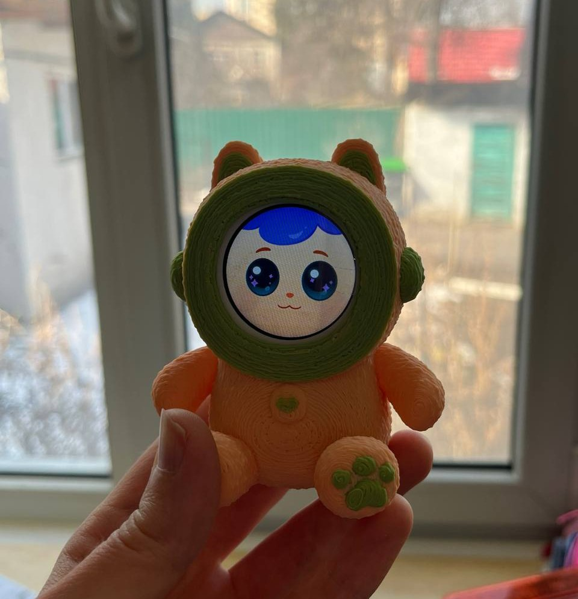

# KawaiiCare — Smart Toy Prototype (Wear OS)

A Wear OS virtual pet application serving as a **smart toy prototype**. The watch displays an animated character that reacts to gestures, sensor input, and remote commands from a companion Android app over a custom local TCP protocol.

This project was successfully **ported to C++ and Qt**.

## Overview

KawaiiCare turns a Wear OS smartwatch into an interactive animated companion. The pet lives on the watch face, responds to physical gestures (tilt, shake, double-tap), manages alarms and reminders, and communicates with a paired Android phone over local Wi-Fi using a custom JSON-based TCP protocol.

The project was developed with the assistance of AI agents to accelerate prototyping and iteration.

## Key Features

- **Animated virtual pet** — frame-by-frame PNG rendering with expressive states (idle/blink, look left/right, nod, shake-smile, fright, notification reactions)
- **Animation state machine (FSM)** — thread-safe finite state machine managing transitions between IDLE → PLAYING → COOLDOWN states, with priority-based buffering, external animation locks for remote control, and force-override for alarms
- **Sensor-driven interaction** — accelerometer-based tilt detection (look left/right), shake detection with continuous-motion requirement, and double-tap gesture recognition
- **Custom gesture recognition** — DTW (Dynamic Time Warping) algorithm for recording and matching user-defined gestures using multi-modal sensor frames (touch, accelerometer, gyroscope)
- **Local TCP communication** — custom socket server (port 8888) with NSD auto-discovery, replacing Google's Wearable Data Layer for non-Google device support
- **Secure pairing** — 6-digit code displayed on watch, token-based authentication (AES-256 encrypted storage), single active client constraint
- **Scheduled events** — unified alarm/reminder system with recurrence support (daily, weekly bitmask), configurable dismissal signals, and boot-persistent scheduling
- **Emoji compositing** — overlays emoji onto the pet's eyes during notification animations
- **Battery-aware rendering** — adapts rendering behavior based on device battery state
- **Guest mode** — full sensor-driven animation without requiring phone pairing

## Architecture

```
┌─────────────────────────────────────────────────┐
│                 Wear OS Watch                    │
│                                                 │
│  ┌───────────┐   ┌──────────────────────────┐  │
│  │ MainActivity│──▶│ AnimationFSM (State Machine)│
│  │ (Launcher) │   │  IDLE → PLAYING → COOLDOWN │
│  └─────┬─────┘   └──────────┬───────────────┘  │
│        │                     │                  │
│  ┌─────▼─────┐   ┌──────────▼───────────────┐  │
│  │  Sensor    │   │  AnimationRenderer       │  │
│  │ Controller │   │  (Frame-by-frame PNG)    │  │
│  └─────┬─────┘   └──────────────────────────┘  │
│        │                                        │
│  ┌─────▼──────────────────────────────────┐     │
│  │  GestureMatcher (DTW) / SignalRegistry │     │
│  └────────────────────────────────────────┘     │
│                                                 │
│  ┌────────────────────────────────────────┐     │
│  │  TcpWearService (port 8888)           │     │
│  │  + NSD Discovery                       │     │
│  │  + Token Auth (AES-256)               │     │
│  └───────────────────┬───────────────────┘     │
└──────────────────────┼──────────────────────────┘
                       │ Local Wi-Fi / TCP
┌──────────────────────▼──────────────────────────┐
│            Companion Android App                 │
│  (Alarm management, remote animation control,   │
│   gesture recording, emoji selection)           │
└─────────────────────────────────────────────────┘
```

## Animation State Machine

The FSM (`AnimationFSM.java`) is the central coordinator for all visual behavior:

| State | Description |
|-------|-------------|
| **IDLE** | Ready to accept new animation requests |
| **PLAYING** | Animation in progress; new requests are buffered (single-slot, priority-based) |
| **COOLDOWN** | Debounce pause (100–2000ms) before accepting new input |

Key behaviors:
- Priority buffering — non-IDLE emotions override buffered IDLE requests
- External animation lock — TCP commands block sensor-driven changes until released
- Force override — alarms bypass the queue and cooldown entirely
- Thread-safe — uses `AtomicReference`, `volatile` fields, and `synchronized` methods

## TCP Protocol

Custom JSON-based protocol (v2.0) over TCP port 8888, max 64KB per message.

**Discovery**: NSD (Network Service Discovery) for automatic watch detection on local Wi-Fi.

**Authentication flow**:
1. Watch displays 6-digit pairing code
2. Client sends `pair` command with code
3. Watch returns auth token (UUID)
4. All subsequent requests authenticated via token

**Supported commands**: `sync_events`, `update_event`, `get_events`, `delete_event`, `set_animation_state`, `set_active_gesture`, `start_recording`, `stop_recording`, `request_emotions`, `set_emoji`, `request_available_emojis`, `request_signals`, `get_status`, `request_logout`

## Alarm Dismissal Signals

| Signal | Sensor | Description |
|--------|--------|-------------|
| SIGNAL_INCLINE | Accelerometer | Tilt wrist to specific angle |
| SIGNAL_SHAKE | Accelerometer | Shake the watch |
| SIGNAL_CIRCLE | Gyroscope | Circular wrist motion |
| SIGNAL_LONG_TOUCH | Touch | Long press on screen |
| SIGNAL_CUSTOM | All + Touch | User-recorded DTW-matched gesture |

## Tech Stack

- **Platform**: Wear OS (minSdk 30 / Android 11)
- **Language**: Java
- **Build**: Gradle 8.13.2, Kotlin DSL
- **UI**: AndroidX Wear + Compose Material
- **Security**: `androidx.security:security-crypto` (AES-256 EncryptedSharedPreferences)
- **Networking**: Raw TCP sockets + NSD
- **Sensors**: Accelerometer, Linear Accelerometer, Gyroscope
- **Animation**: Custom frame-by-frame PNG renderer on SurfaceView

## Project Structure

```
app/src/main/java/com/.../kawaicare/
├── alarm/          # AlarmManager scheduling, gesture matching, signal registry
├── animation/      # FSM, renderer, face/emoji compositing, surface view
├── auth/           # Session/token management
├── data/           # Alarm status repository
├── event/          # Scheduled event model, repository, scheduler, recurrence
├── model/          # Gesture session data model
├── network/        # TCP server/client, NSD discovery, protocol handling
├── recording/      # Custom gesture recording
├── sensor/         # Accelerometer/gyroscope controller
├── ui/             # MainActivity, SettingsActivity, LoadingActivity
├── util/           # Utilities
└── wear/           # Wear OS integration helpers
```

## Status

This Wear OS prototype has been **successfully ported to C++ and Qt**.

